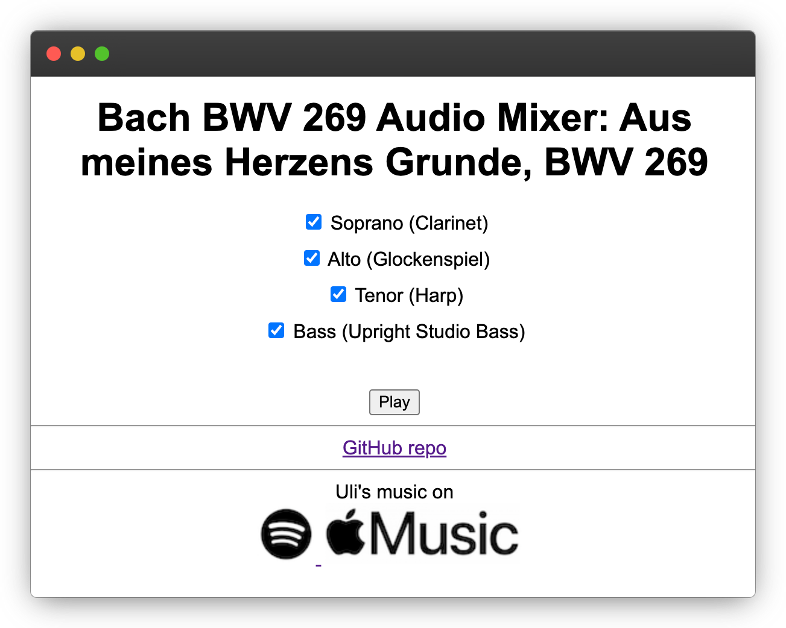

# BWV 269 Audio Mixer

Welcome to the BWV 269 Audio Mixer, an interactive web app that lets you dive into the harmonies of Bach's chorale BWV 269. This project aims to provide a unique and immersive way to study and appreciate the polyphonic structure of Bach's incredible music.

[Try it here.](https://uli.hitzel.net/BWV-269-Audio-Mixer/)

## Motivation

As a lover of Bach's music, I wanted to find a way to break down the complex harmonies of his chorales into their individual voices. By assigning each voice a distinctive instrument and progressively building them back up, I believed it would be easier to identify and understand how each voice contributes to the overall polyphonic structure.

However, I couldn't find any existing resources that provided this kind of interactive experience. So, I decided to create it myself. I wanted this project to exist not only for my own study and enjoyment but also for others who share the same passion for exploring Bach's musical genius.

## Features

- Four individual audio tracks representing the soprano, alto, tenor, and bass voices of BWV 269
- Each voice is assigned a distinctive instrument for easy identification
- Interactive checkboxes to toggle each voice on/off during playback
- Synchronized playback of all voices, allowing seamless switching between different combinations
- Simple and intuitive user interface for a smooth exploration experience

## How to Use

1. Open the `index.html` file in your web browser. [Or this live site.](https://uli.hitzel.net/BWV-269-Audio-Mixer/)
2. Click the "Play" button to start the playback of the chorale.
3. Use the checkboxes next to each voice to toggle them on/off during playback.
4. Experiment with different combinations of voices to understand how they interact and contribute to the overall harmony.
5. Enjoy the beauty of Bach's music and discover new insights into his compositional techniques!

## Files

- `index.html`: The main HTML file that contains the structure of the web app.
- `styles.css`: The CSS file that defines the styling of the web app.
- `script.js`: The JavaScript file that handles the audio playback and user interactions.
- `voice1.mp3`, `voice2.mp3`, `voice3.mp3`, `voice4.mp3`: The individual audio files for each voice.

I hope this project brings you joy and enhances your appreciation for Bach's timeless music. If you have any feedback, suggestions, or questions, please feel free to reach out.

## Music on Spotify and Apple Music

This project uses recordings from Bach arrangements that I released on [Spotify](https://open.spotify.com/album/0gnRSuQ2qL5JuXlo0YAL2C) and [Apple Music](https://music.apple.com/us/artist/uli-hitzel/1739466607).

Happy exploring!